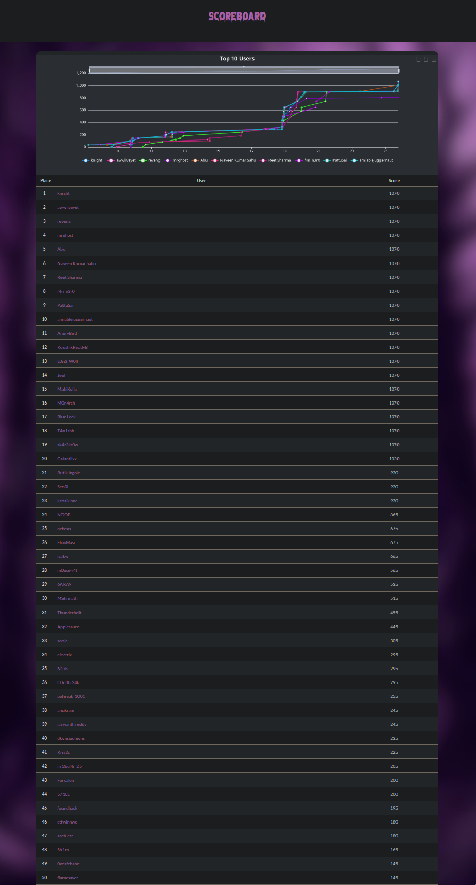
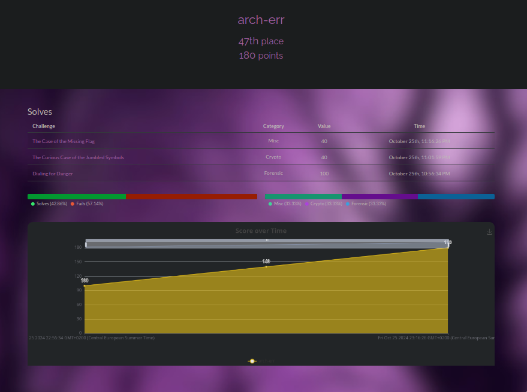

# Hack-Havoc-CTF-2024
- https://ctf.cybermaterial.com/challenges

## Description
**

# Results
**Username:** arch-err

**Team:** none

**Flags:** (0/15)

# Challenges
- [ ] [Cloudy_Records](Cloudy_Records)
- [ ] [Dialing_for_Danger](Dialing_for_Danger)
- [ ] [QR-azy_Mystery!](QR-azy_Mystery!)
- [ ] [Dir_Dash](Dir_Dash)
- [ ] [Pickle_Me_This_Cookie_Jar_Shenanigans](Pickle_Me_This_Cookie_Jar_Shenanigans)
- [ ] [Hackers_Fortress](Hackers_Fortress)
- [ ] [The_Curious_Case_of_the_Jumbled_Symbols](The_Curious_Case_of_the_Jumbled_Symbols)
- [ ] [CyberMaterialHavoc](CyberMaterialHavoc)
- [ ] [The_Case_of_the_Missing_Flag](The_Case_of_the_Missing_Flag)
- [ ] [More_Like_Enig-me](More_Like_Enig-me)
- [ ] [p13ces](p13ces)
- [ ] [Incidents_in_Disguise](Incidents_in_Disguise)
- [ ] [Hack_Uncovered](Hack_Uncovered)
- [ ] [CyberMaterial_Edition](CyberMaterial_Edition)
- [ ] [APK-ocaplyse_Now](APK-ocaplyse_Now)
